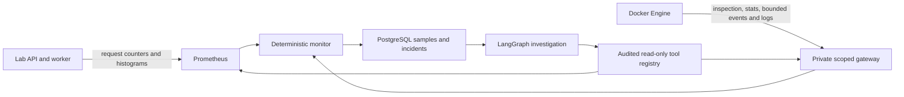

# Telemetry architecture

Docker observations include identity, state, exit code, health output, restart count, OOM
metadata, start/finish timestamps, actual CPU and working-set memory, limit, source, and time.
Lifecycle events use Docker's bounded historical event stream, filtered to the affected
container. The stream is closed after its limit; arbitrary actor attributes are omitted.

The demos instrument completed requests by service/endpoint/status, durations by
service/endpoint, and in-flight request gauges. Structured JSON logs record real request
status/duration, allocations, crash exit marker, and workload changes. No synthetic
telemetry is inserted into Pulse. Only the application's workload/data are synthetic.

The monitor uses persisted rolling windows and consecutive violations. HTTP rules require
at least `http_min_requests` actual histogram/counter observations. Scrape timestamps are
checked separately from query evaluation time. Missing, nonfinite, or stale measurements
are unavailable, never a measured zero. Prometheus metadata is retained in detection evidence.
The services API withholds stale current metrics; historical samples remain inspectable.

A unique active incident key prevents repeated alerts. Cooldown handles later incidents;
the evaluator configures a zero cooldown only in its disposable database and restores settings.
Docker failures generate `telemetry.failed` events. Bounded exponential backoff prevents
busy loops; provider failures do not stop deterministic monitoring. Three fixed metric
queries run concurrently per service, with bounded HTTP timeouts.

PromQL is a fixed template set with JSON-escaped service selectors, not arbitrary model
queries. The instrument schema remains `demo_http_*`; other applications need equivalent
instrumentation. Detection uses aggregate service latency/error ratio; affected endpoints
are visible in application logs and instrument labels, not a separate endpoint alert key.
